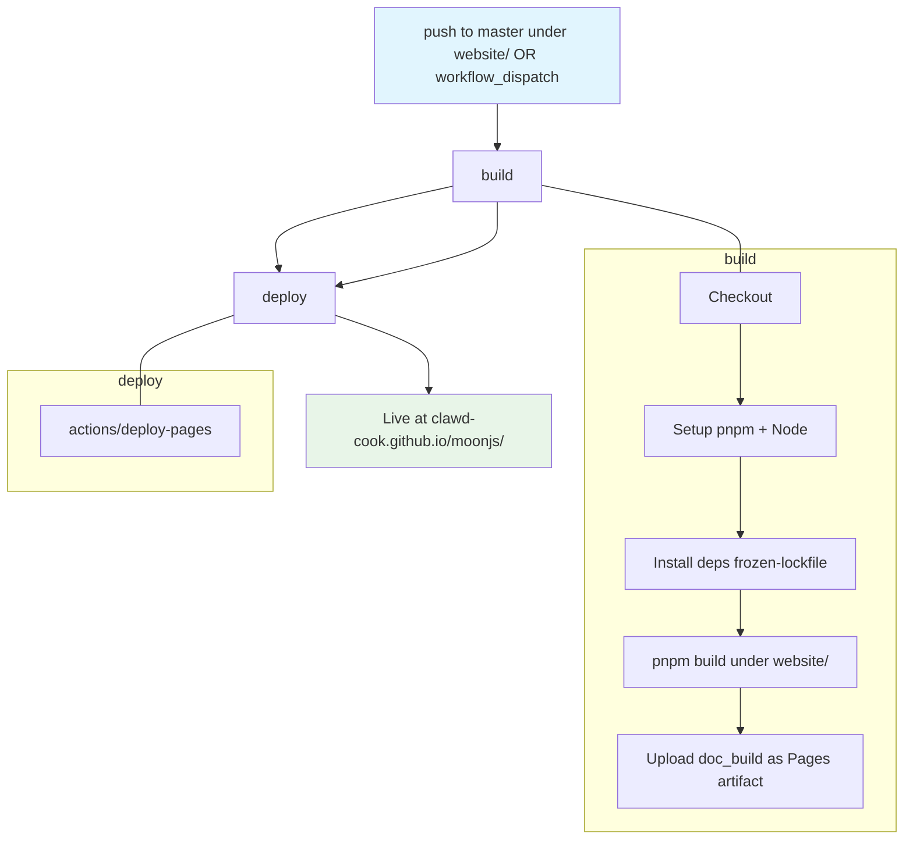

## Workflow Overview

**Purpose**: On every merge to `master` (or on demand), build the Rspress-based docs site under `website/` and deploy the static output to GitHub Pages at `https://clawd-cook.github.io/moonjs/`.

**Trigger Events**:
- `push` to `master` when files under `website/**` or `.github/workflows/pages.yml` change
- `workflow_dispatch` (manual redeploy)

**Target Environments**:
- Runner: `ubuntu-latest`
- Deploy target: GitHub Pages environment `github-pages` on repository `clawd-cook/moonjs`
- Public URL: `https://clawd-cook.github.io/moonjs/`

## Execution Flow Diagram



## Jobs & Dependencies

| Job Name | Purpose | Dependencies | Execution Context |
|----------|---------|--------------|-------------------|
| `build` | Install pnpm deps under `website/`, run `pnpm build` (Rspress SSG), upload `website/doc_build/` as the GitHub Pages artifact. | none | `ubuntu-latest`, pnpm + Node 20, no MoonBit needed |
| `deploy` | Publish the uploaded artifact to the `github-pages` environment. | `build` succeeds | `ubuntu-latest`, `pages: write` + `id-token: write` |

The site is fully static; no server-side runtime beyond GitHub Pages' Nginx-equivalent.

## Requirements Matrix

### Functional Requirements

| ID | Requirement | Priority | Acceptance Criteria |
|----|-------------|----------|---------------------|
| REQ-001 | Auto-deploy on `master` changes to `website/**` | High | A push touching a file under `website/` produces a live update within ~5 minutes. |
| REQ-002 | Manual redeploy via `workflow_dispatch` | High | Actions UI's "Run workflow" button triggers the same pipeline with the current `master` head. |
| REQ-003 | Respect `base: '/moonjs/'` | High | Deployed site serves under `https://clawd-cook.github.io/moonjs/` (all asset URLs resolve). |
| REQ-004 | Bilingual paths present | High | `/moonjs/` (English), `/moonjs/zh/` (Chinese), `/moonjs/guide/playground` all return `200 OK` post-deploy. |
| REQ-005 | No MoonBit toolchain at build time | High | The runner needs only Node + pnpm; the checked-in playground bundle at `website/src/moonjs-playground/moonjs-playground.js` is used as-is. |
| REQ-006 | Deploy is atomic | Medium | If artifact upload fails, the previous deployment stays live. |
| REQ-007 | Pages env is used | Medium | Deployment goes to the built-in `github-pages` environment, not a custom fork. |
| REQ-008 | Skip on unrelated changes | Medium | A push touching only `src/**` (MoonBit engine) or `.trellis/**` does NOT trigger a rebuild — those changes reach the site only when a `website/` file is also updated (or a manual trigger is used). |

### Security Requirements

| ID | Requirement | Implementation Constraint |
|----|-------------|---------------------------|
| SEC-001 | Least-privilege token per job | `build` runs with `contents: read`; `deploy` runs with `contents: read`, `pages: write`, `id-token: write`. No repo-wide elevated permissions. |
| SEC-002 | Third-party actions pinned | Every `uses:` action pinned to a full commit SHA. |
| SEC-003 | No secrets required | This workflow reads no repository secrets. If future analytics keys are added they must be repository secrets, not committed values. |
| SEC-004 | Fork PRs cannot deploy | The workflow does not run on `pull_request`; only pushes to `master` (main-branch protected) and `workflow_dispatch` (require repo write). |

### Performance Requirements

| ID | Metric | Target | Measurement Method |
|----|--------|--------|-------------------|
| PERF-001 | End-to-end wall clock | < 4 min | GitHub Actions run summary |
| PERF-002 | `build` runtime | < 2 min | Timed step; dominated by `pnpm build` |
| PERF-003 | pnpm install cache hit rate | > 80% after 3 runs | `actions/setup-node` cache key hits |

## Input/Output Contracts

### Inputs

```yaml
on:
  push:
    branches: [ master ]
    paths:
      - 'website/**'
      - '.github/workflows/pages.yml'
  workflow_dispatch:

# Environment
GITHUB_TOKEN: token   # Auto-provided, scoped per job
```

### Outputs

```yaml
# Artifact
pages_artifact: directory   # website/doc_build/ tar.gz uploaded via actions/upload-pages-artifact

# Deployment
deployment_url: string      # e.g. https://clawd-cook.github.io/moonjs/
```

### Secrets & Variables

None. The workflow reads no secrets. GitHub Pages configuration is managed in repository Settings → Pages (source = "GitHub Actions").

## Execution Constraints

### Runtime Constraints

- **Timeout**: `build` 10 min, `deploy` 5 min. Total 15 min.
- **Concurrency**: `concurrency: group: pages, cancel-in-progress: true`. Rationale: docs deployments are safe to preempt — always take the newest master.
- **Resource Limits**: Standard `ubuntu-latest` runner is more than enough for a static site.

### Environmental Constraints

- **Runner Requirements**: `ubuntu-latest`. `pnpm` v9, Node 20.
- **Network Access**: Egress to `registry.npmjs.org` (or configured mirror) at install time. No egress required at build time beyond that.
- **Permissions**: See SEC-001. The `deploy` job needs `id-token: write` for OIDC handshake with GitHub Pages.

## Error Handling Strategy

| Error Type | Response | Recovery Action |
|------------|----------|-----------------|
| pnpm install failure | Fail `build`; deploy skipped | Re-run workflow; if persistent, check pnpm-lock.yaml integrity |
| `pnpm build` SSR error | Fail `build` | Fix content / component; commit; auto-redeploy |
| Playground bundle drift | Not directly caught here — `pnpm build` succeeds even if the bundle is stale | Contributor runs `pnpm rebuild:engine` locally after MoonBit changes and commits the refreshed bundle |
| Artifact upload failure | Fail `deploy`; last deployment remains | Re-run workflow |
| Pages deploy 5xx | Fail `deploy`; last deployment remains | Re-run workflow |
| Broken links | Not caught (rspress doesn't fail-on-broken-link by default) | Optional future addition: rspress `checkDeadLinks: true` in config |

## Quality Gates

### Gate Definitions

| Gate | Criteria | Bypass Conditions |
|------|----------|-------------------|
| Static build succeeds | `pnpm build` exits 0 and produces `website/doc_build/` | None |
| Artifact non-empty | `website/doc_build/` contains at least `index.html` | None |
| Pages environment configured | Repo Settings → Pages source is "GitHub Actions" | Configured once at setup; workflow does not verify this — a missing config surfaces as a `deploy` step error |

## Monitoring & Observability

### Key Metrics

- **Success Rate**: ≥ 98% on green master pushes.
- **Execution Time**: Median < 3 min; alert if p95 > 8 min.
- **Deployment frequency**: as high as changes warrant; no rate limit relevant.

### Alerting

| Condition | Severity | Notification Target |
|-----------|----------|---------------------|
| Any failure on `master` push | Medium | Repo watchers via GitHub notification |
| 2 consecutive failed deploys | High | Manual investigation |

## Integration Points

### External Systems

| System | Integration Type | Data Exchange | SLA Requirements |
|--------|------------------|---------------|------------------|
| GitHub Pages (`github-pages` environment) | Static site hosting | HTML/JS/CSS artifact tarball | GitHub SLA |
| `registry.npmjs.org` (or mirror) | pnpm install | npm packages | Best-effort |

### Dependent Workflows

| Workflow | Relationship | Trigger Mechanism |
|----------|--------------|-------------------|
| `release.yml` | Sibling — releases publish to mooncakes + GitHub Release; this workflow publishes docs. No hard dependency; a release does NOT auto-redeploy docs (docs update on the `website/**` change that accompanies the release, if any). | Independent |
| `copilot-setup-steps.yml` | Independent | Different event |

## Compliance & Governance

### Audit Requirements

- **Execution Logs**: Retained per default GitHub Actions policy (90 days).
- **Approval Gates**: None. Docs deploy on merge to `master` (branch protection guards `master`).
- **Change Control**: Workflow file changes go via PR + CI; production deployment happens automatically on merge.

### Security Controls

- **Access Control**: Only maintainers can push to `master` (branch protection). Fork PRs cannot deploy.
- **Secret Management**: N/A — no secrets used.
- **Vulnerability Scanning**: Dependabot on `website/package.json` catches vulnerable npm deps.

## Edge Cases & Exceptions

### Scenario Matrix

| Scenario | Expected Behavior | Validation Method |
|----------|-------------------|-------------------|
| Push touches only `src/**` (engine) | Workflow does NOT run; docs stay at previous deploy | Push a MoonBit-only change |
| Push touches only `website/docs/**` (content) | Workflow runs; new content live in ~3 min | Push a docs typo |
| Push touches `website/src/moonjs-playground/moonjs-playground.js` (regenerated bundle) | Workflow runs; playground page loads the new bundle URL (cache-busted by content hash) | Regenerate playground + push |
| Two rapid pushes in succession | First run is cancelled by `cancel-in-progress: true`; only the newer run deploys | Push twice within 30 s |
| `pnpm-lock.yaml` diverged from `package.json` | `pnpm install --frozen-lockfile` fails | Force a mismatch |
| GitHub Pages source set to "Deploy from branch" instead of "GitHub Actions" | `deploy` step errors with "Pages source misconfigured" | Repo Settings validation |
| `workflow_dispatch` on a branch other than `master` | Actions UI can only run against `master` for this workflow (default branch semantics); attempting to run against a feature branch is a user error, not a workflow bug | Confirm via Actions UI |

## Validation Criteria

### Workflow Validation

- **VLD-001**: On a `website/docs/en/index.md` typo push, the change is live at `https://clawd-cook.github.io/moonjs/` within 5 minutes.
- **VLD-002**: Both `/moonjs/` (en) and `/moonjs/zh/` (zh) return HTTP 200 with the expected `<h1>` after deploy.
- **VLD-003**: `/moonjs/guide/playground` renders the Playground component and dynamically loads `moonjs-playground.js` (network tab shows the script loading; entering `1 + 2` and Run yields `3`).
- **VLD-004**: A push touching only `README.md` (root, outside `website/`) does NOT trigger the workflow.
- **VLD-005**: `workflow_dispatch` from Actions UI produces a fresh deployment even without any file change.
- **VLD-006**: The workflow uses zero repository secrets — a fork-cloned copy runs identically (up to Pages env availability).

### Performance Benchmarks

- **PERF-001**: 3 consecutive successful runs must have a median wall clock < 3 min.
- **PERF-002**: With pnpm cache hit, `pnpm install --frozen-lockfile` completes in < 30 s.
- **PERF-003**: `pnpm build` completes in < 90 s for the current docs corpus (16 pages + playground bundle chunk).

## Change Management

### Update Process

1. **Specification Update**: Modify this document first.
2. **Review & Approval**: Repository maintainer review.
3. **Implementation**: Update `.github/workflows/pages.yml`.
4. **Testing**: `workflow_dispatch` on `master` to validate.
5. **Deployment**: Automatic on next push to `master` (or the manual dispatch above).

### Version History

| Version | Date | Changes | Author |
|---------|------|---------|--------|
| 1.0 | 2026-09-11 | Initial specification | heyongqi10 |

## Related Specifications

- `.trellis/spec/cicd/spec-process-cicd-release.md` — release workflow that publishes MoonJS to mooncakes.io + GitHub Releases; touches different files, different targets.
- `.trellis/tasks/09-11-web-playground/prd.md` — playground bundle contract; the bundle is a checked-in artifact this workflow ships as-is.
- `website/rspress.config.ts` — `base: '/moonjs/'`, `siteOrigin: 'https://clawd-cook.github.io'`; MUST stay consistent with the deployed URL.
