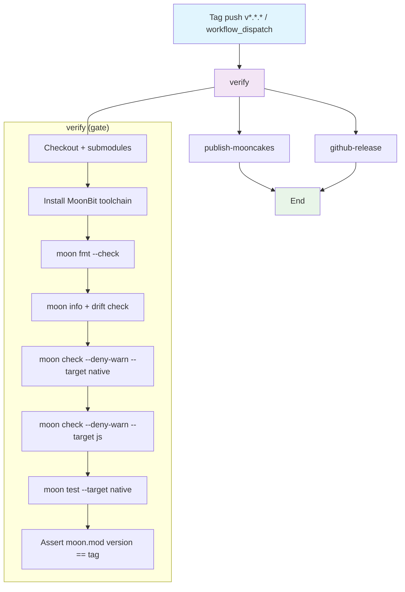

## Workflow Overview

**Purpose**: On a version-tag push, verify quality gates, publish the MoonBit module `heyq02/moonjs` to mooncakes.io, and publish a matching GitHub Release with generated notes and release artifacts.

**Trigger Events**:
- `push` on tags matching `v*.*.*` (semver, e.g. `v0.1.0`, `v1.2.3-rc.1`)
- `workflow_dispatch` with an explicit `tag` input (manual re-run for a failed release)

**Target Environments**:
- Runner: `ubuntu-latest`
- Package registry: mooncakes.io (module `heyq02/moonjs`)
- Release publication: `github.com/clawd-cook/moonjs`

## Execution Flow Diagram



## Jobs & Dependencies

| Job Name | Purpose | Dependencies | Execution Context |
|----------|---------|--------------|-------------------|
| `verify` | Pre-release quality gate. Compiles both targets, runs full test suite, confirms `moon.mod:version` matches the pushed tag. Blocks downstream jobs on any failure. | none | `ubuntu-latest`, MoonBit toolchain installed inline |
| `publish-mooncakes` | Runs `moon publish` against mooncakes.io with the CI credential injected. Uploads the module artefact. | `verify` succeeds | `ubuntu-latest`, MoonBit toolchain, `MOON_CREDENTIAL` secret in env |
| `github-release` | Creates or updates a GitHub Release for the tag, attaches auto-generated release notes and a source tarball. Runs in parallel with `publish-mooncakes` to reduce wall clock. | `verify` succeeds | `ubuntu-latest`, `contents: write` permission |

Parallelism note: `publish-mooncakes` and `github-release` execute independently after `verify`; failure of one does NOT abort the other (each is idempotent and can be retried).

## Requirements Matrix

### Functional Requirements

| ID | Requirement | Priority | Acceptance Criteria |
|----|-------------|----------|---------------------|
| REQ-001 | Trigger only on semver tag pushes | High | Regex `^v\d+\.\d+\.\d+(-.+)?$` matches; other tag shapes do NOT run the workflow. |
| REQ-002 | Confirm `moon.mod` version matches the tag | High | With tag `vX.Y.Z`, `verify` reads `moon.mod`, extracts `version`, asserts equality to `X.Y.Z`; mismatch fails the job with a clear message. |
| REQ-003 | Full quality gate on `verify` | High | `moon fmt` idempotent, `moon check --deny-warn` clean on `--target native` AND `--target js`, `moon test --target native` all green. Any failure blocks publication. |
| REQ-004 | Publish to mooncakes.io | High | `moon publish` succeeds; job output includes the published module URL / version. Re-running on an already-published tag surfaces the mooncakes duplicate-version error clearly (does NOT falsely succeed). |
| REQ-005 | Create GitHub Release | High | Release for tag `vX.Y.Z` exists after job completes, with title `MoonJS vX.Y.Z`, auto-generated notes from commits since the previous tag. |
| REQ-006 | Attach source tarball | Medium | `moonjs-vX.Y.Z-source.tar.gz` (repository archive without `.git`, `node_modules`, `_build`, `doc_build`, `quickjs/test262`) attached to the GitHub Release. |
| REQ-007 | Manual re-run for one tag | Medium | `workflow_dispatch` accepts a `tag` string input; specified tag must already exist on the remote; workflow processes it identically to a tag push. |
| REQ-008 | Idempotency on retry | Medium | Re-running the workflow after partial success (e.g. GitHub Release already exists, mooncakes publish failed) allows the failed step to succeed without cleanup, and the successful step logs "already published" instead of erroring. |
| REQ-009 | Docs-site verification | Low | `verify` runs `pnpm --dir website install --frozen-lockfile && pnpm --dir website build` to confirm the website (which pins the mooncakes bundle) still builds. |

### Security Requirements

| ID | Requirement | Implementation Constraint |
|----|-------------|---------------------------|
| SEC-001 | Mooncakes credential is a repository secret | Stored as `MOON_CREDENTIAL` secret; the workflow writes it to `~/.moon/credentials.json` **only inside the `publish-mooncakes` job**; masked in logs. |
| SEC-002 | Least-privilege token scope | `permissions:` block on each job requests only what it needs. `verify`: `contents: read`. `publish-mooncakes`: `contents: read`. `github-release`: `contents: write`. |
| SEC-003 | Third-party actions pinned | Every `uses:` action is pinned to a full commit SHA, not a floating tag. |
| SEC-004 | No token echo | The `MOON_CREDENTIAL` value never appears in `run:` commands as an argument (piped through env only). `set +x` maintained during credential-file writes. |
| SEC-005 | Submodule handling | Checkout uses `submodules: 'recursive'` only if `quickjs/` is needed for verification; the `test262` sub-submodule stays uninitialized (test262 is not needed for M1..M5 releases). |

### Performance Requirements

| ID | Metric | Target | Measurement Method |
|----|--------|--------|-------------------|
| PERF-001 | End-to-end wall clock (green path) | < 10 min | GitHub Actions run summary timestamp diff |
| PERF-002 | `verify` job runtime | < 6 min | `moon check` + `moon test` combined |
| PERF-003 | `publish-mooncakes` runtime | < 2 min | `moon publish` step duration |
| PERF-004 | Toolchain install cache hit rate | > 80% after 3 runs | `actions/cache` restore-key logs; MoonBit toolchain cached by version. |

## Input/Output Contracts

### Inputs

```yaml
# Trigger inputs
on:
  push:
    tags: [ 'v*.*.*' ]
  workflow_dispatch:
    inputs:
      tag:
        description: 'Existing tag to re-release (e.g. v0.1.0)'
        required: true
        type: string

# Environment variables provided by GitHub Actions
GITHUB_REF: string          # refs/tags/vX.Y.Z on push; via input on manual run
GITHUB_TOKEN: token         # auto-provided by Actions; scoped by `permissions:`

# Repository triggers — nothing outside `push` on version tags
```

### Outputs

```yaml
# Job outputs
verify.tag_version: string        # X.Y.Z (without leading v) — consumed by both downstream jobs
verify.notes_since_tag: string    # optional; previous tag reference for release-notes generation

publish-mooncakes.published: bool # true on successful publish
publish-mooncakes.module_url: url # https://mooncakes.io/docs/heyq02/moonjs

github-release.release_url: url   # https://github.com/clawd-cook/moonjs/releases/tag/vX.Y.Z

# Artifacts
source_tarball: file              # moonjs-vX.Y.Z-source.tar.gz attached to Release
```

### Secrets & Variables

| Type | Name | Purpose | Scope |
|------|------|---------|-------|
| Secret | `MOON_CREDENTIAL` | Contents of `~/.moon/credentials.json` — `{"token": "…", "username": "heyq02"}`. Used by `moon publish` to authenticate against mooncakes.io. | Workflow (only `publish-mooncakes` reads it) |
| Secret | `GITHUB_TOKEN` | Auto-provided by GitHub Actions. Used by `github-release` for the Release API call. | Auto-managed, per-job |
| Variable | `MOONBIT_VERSION` | Optional pin of MoonBit toolchain version. If unset, install steps default to the latest stable published to `cli.moonbitlang.com`. | Repository |

## Execution Constraints

### Runtime Constraints

- **Timeout**: `verify` 10 min, `publish-mooncakes` 5 min, `github-release` 5 min. Total workflow ceiling 20 min.
- **Concurrency**: `concurrency: group: release-${{ github.ref }}, cancel-in-progress: false`. Rationale: releases are irreversible; a second concurrent run should queue, not preempt.
- **Resource Limits**: Standard `ubuntu-latest` runner (2 vCPU, 7 GB RAM) is sufficient. The MoonBit test suite currently runs in < 30 s locally.

### Environmental Constraints

- **Runner Requirements**: `ubuntu-latest` (Linux x86_64). MoonBit's `cli.moonbitlang.com/install/unix.sh` supports Linux/macOS; Linux is chosen for consistency and cost.
- **Network Access**: Egress to `cli.moonbitlang.com` (install), `mooncakes.io` (publish), `api.github.com` (Release).
- **Permissions**: See SEC-002.

## Error Handling Strategy

| Error Type | Response | Recovery Action |
|------------|----------|-----------------|
| MoonBit install failure | Fail `verify` fast | Re-run workflow; if persistent, pin `MOONBIT_VERSION` |
| `moon fmt` drift | Fail `verify` | Run `moon fmt` locally, commit, re-tag |
| `moon check --deny-warn` failure | Fail `verify` | Fix warnings on `master`, delete tag, re-tag |
| `moon test` red | Fail `verify` | Fix broken tests on `master`, delete tag, re-tag |
| `moon.mod` version mismatch | Fail `verify` with explicit diff message | Bump `moon.mod:version` in a follow-up commit; delete stale tag; re-tag |
| Mooncakes duplicate version | Fail `publish-mooncakes` non-fatally (visible error) | Bump `moon.mod:version`; new tag |
| Mooncakes 5xx / timeout | Fail `publish-mooncakes` | Re-run via `workflow_dispatch` |
| GitHub Release already exists | Update in place (`gh release edit`) | Not treated as error |
| Docs website build failure | Fail `verify` | Fix `website/` build; may require `pnpm rebuild:engine` if playground bundle drifted; commit; re-tag |

## Quality Gates

### Gate Definitions

| Gate | Criteria | Bypass Conditions |
|------|----------|-------------------|
| Version alignment | `moon.mod:version == tag[1:]` (strip leading `v`) | None. Hard block. |
| Format | `moon fmt` produces no diff | None. |
| Type / lint | `moon check --deny-warn` clean on `--target native` AND `--target js` | None. |
| Tests | `moon test --target native` all pass, zero failures | None. |
| Docs site build | `pnpm --dir website build` completes without SSR errors | Skipped only if `website/` was untouched since previous release (future optimization, not v1). |

## Monitoring & Observability

### Key Metrics

- **Success Rate**: Target ≥ 95% green on first-try tag pushes. Below that, planning attention required.
- **Execution Time**: Median run < 8 min; alert if p95 > 15 min.
- **Resource Usage**: Recorded via GitHub Actions Insights — no custom telemetry needed.

### Alerting

| Condition | Severity | Notification Target |
|-----------|----------|---------------------|
| Any failure on `master` tag push | High | Repository maintainer (email via GitHub) |
| `publish-mooncakes` failure | High | Same |
| `verify` runtime > 15 min | Medium | Insights dashboard review |
| 3 consecutive failed runs | Critical | Manual investigation |

## Integration Points

### External Systems

| System | Integration Type | Data Exchange | SLA Requirements |
|--------|------------------|---------------|------------------|
| mooncakes.io | REST publish via `moon publish` | Module tarball upload; version metadata | Best-effort; hosted third-party |
| GitHub Releases | REST via `gh release create/edit` | Tag, name, body, assets | GitHub SLA |
| `cli.moonbitlang.com` | HTTPS install script | Toolchain download | Best-effort |

### Dependent Workflows

| Workflow | Relationship | Trigger Mechanism |
|----------|--------------|-------------------|
| `copilot-setup-steps.yml` | Independent (Copilot agent setup only) | Different event — no dependency |
| GitHub Pages deployment (future) | Downstream — reads the new Release / mooncakes bundle | Cronjob or `repository_dispatch` from `github-release` job (v2 enhancement) |

## Compliance & Governance

### Audit Requirements

- **Execution Logs**: Retained by GitHub Actions per repo policy (default 90 days). All `run:` outputs kept.
- **Approval Gates**: v1 has none. Any human wanting to gate a release does so by not creating the tag; a future `environments:` gate with required reviewers is possible.
- **Change Control**: Updates to `.github/workflows/release.yml` land via normal PRs and require green CI on the PR before merge.

### Security Controls

- **Access Control**: `MOON_CREDENTIAL` secret is only readable by admin/maintainers; not exposed in PR runs from forks (see SEC-004).
- **Secret Management**: `MOON_CREDENTIAL` should be rotated when the mooncakes token is regenerated (no fixed schedule; rotate on personnel changes).
- **Vulnerability Scanning**: MoonBit toolchain is pinned to a specific version tag when a supply-chain concern arises; otherwise `latest`.

## Edge Cases & Exceptions

### Scenario Matrix

| Scenario | Expected Behavior | Validation Method |
|----------|-------------------|-------------------|
| Tag pushed but `moon.mod` version wasn't bumped | `verify` fails at version-alignment step; publish jobs never run | Manually pushing `vX.Y.Z` with stale `moon.mod` |
| Tag pushed on a branch without the tagged commit as ancestor | Not possible — `push: tags:` fires only on the tag's commit; the workflow only ever runs against the tagged SHA | GitHub Actions semantics |
| Duplicate publish (workflow re-run on same tag) | `publish-mooncakes` fails with a mooncakes-side "already exists" — recorded and does NOT block `github-release` | `workflow_dispatch` on a published tag |
| `github-release` re-run | Existing Release is patched (title + body + asset re-uploaded) via `gh release edit` fallback | `workflow_dispatch` on a released tag |
| Pre-release tag (`v0.2.0-rc.1`) | Same pipeline, but `github-release` marks the Release as pre-release when the tag has a `-suffix` | Push `v0.2.0-rc.1` |
| Manual `workflow_dispatch` with a non-existent tag | Job fails fast at checkout | Manual test |
| `MOON_CREDENTIAL` missing | `publish-mooncakes` fails at the credential-write step with a masked "missing secret" message; `github-release` proceeds normally | Un-set secret in a test clone |
| Docs site build fails | `verify` fails; nothing is released. | `pnpm build` reproduces failure locally |
| `quickjs/` submodule not initialized | Not required — releases don't ship `quickjs/`; the tarball explicitly excludes it | See REQ-006 |

## Validation Criteria

### Workflow Validation

- **VLD-001**: On a well-formed `v0.1.0` tag push, all three jobs complete green within 10 min and produce a mooncakes entry + GitHub Release.
- **VLD-002**: On a `moon.mod` version mismatch, `verify` fails with a clear diff message; downstream jobs do not run.
- **VLD-003**: On `moon check --deny-warn --target js` failure, `verify` fails; the js target error is visible in the log.
- **VLD-004**: On repeat `workflow_dispatch` of an already-published tag, mooncakes reports "already exists" and GitHub Release is patched in place; overall workflow returns a soft failure (mooncakes-only), not silent success.
- **VLD-005**: Credential secret is never printed. Confirmed by scanning the log for the literal token value; grep must return zero hits.

### Performance Benchmarks

- **PERF-001**: 3 consecutive successful runs on the same major/minor line must have a median wall-clock < 8 min.
- **PERF-002**: MoonBit toolchain install with cache hit ≤ 30 s; cold install ≤ 2 min.
- **PERF-003**: Full `moon test --target native` under 60 s (currently ~15 s locally).

## Change Management

### Update Process

1. **Specification Update**: Modify this document first.
2. **Review & Approval**: Repository maintainer reviews the diff; changes touching SEC or REQ require a second reviewer.
3. **Implementation**: Update `.github/workflows/release.yml` to match.
4. **Testing**: On a scratch tag (e.g. `v0.0.0-test`) run the workflow via `workflow_dispatch` to validate.
5. **Deployment**: Merge to `master`; the next real tag exercises the new workflow.

### Version History

| Version | Date | Changes | Author |
|---------|------|---------|--------|
| 1.0 | 2026-09-11 | Initial specification | heyongqi10 |

## Related Specifications

- `.trellis/tasks/09-10-moonjs-js-engine/prd.md` — parent module goals; sets what "releasable" means.
- `.trellis/tasks/09-11-web-playground/prd.md` — playground bundle is regenerated per release (via `pnpm rebuild:engine`), and the release-time `pnpm build` gate covers it.
- `.trellis/spec/backend/quality-guidelines.md` — the toolchain gate that `verify` enforces is grounded here.
